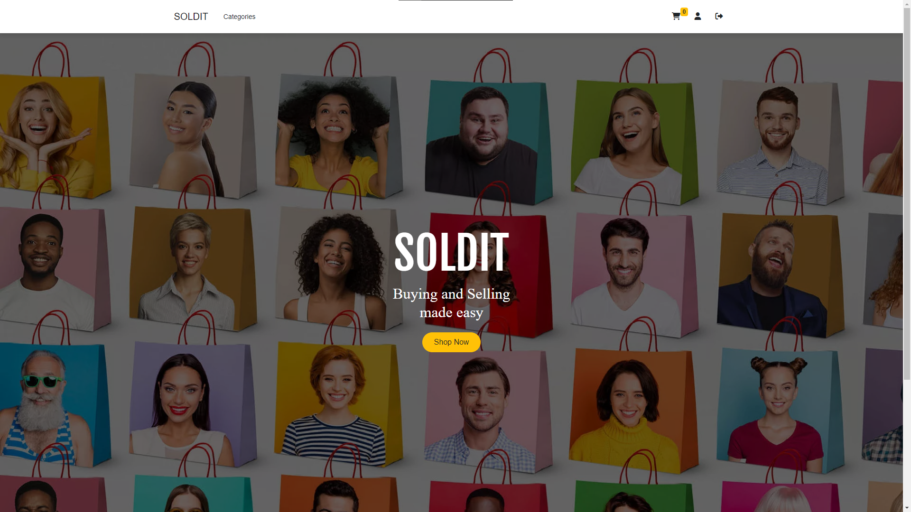

# Soldit - Ecommerce

### https://soldit-shop-ffbb257f110b.herokuapp.com/
Soldit aims to be the reddit of Ecommerce. It offers an effortless and user-friendly platform for listing and purchasing products, ensuring a seamless and swift experience for its users. The shop includes stripe payment system for fast and secure payments. 

## Features

- Secure Login using Google Oauth
- Ability to add, update and delete both products and reviews.
- Ability to add items to basket and then 'purchase' using Stripe
- Different view screens to view items by category
- A screen to track previous orders
- A screen to display all information about a specific product

## 

## Technologies used

- JavaScript
- Ejs
- Bootstrap
- Css
- Stripe
- Mongo DB
- Mongoose
- Node JS
- Express JS
- Google Oauth

## Planning for the project 

Basic wireframe and erd

### Trello board: https://trello.com/b/Jo0d7WDP/ecommerce

When planning for this project I set out to have 2 main data entries, these were: Users and Products.
Within the Users data contained more data structures such as: basket, selling and purchases. These were all one to many relationships so they were nested in the users data. Products also had a sub data entry which was for reviews. Every interaction with the database either included a user or a product making it very simple to understand what and where to get the correct information.\
I also made some wireframes to help with structuring the main page and the flow of how the site would navigate.

## Challenges

Being my first full stack aplication I found communicating with the database quite a challenge as I was not used to the server routing api requests and with the basics of mongoose. Throughout the week this did get a lot easier as I increased my understanding of the express backend structure.

Another challenge was working with Stripe api because it was only the second third-party api I had used (after google Oauth). Understanding how you send the request and redirect to and from the Stripe interface was a big challenge. This did help me to start to understand how to read through documentation and aproach new areas from no prior knowledge. 

## Regrets and Icebox

When creating the project I forgot to plan to use the date of creation on products and orders. This meant that it was impossible to show how long ago an item was uploaded or ordered without having to go back and refactor a lot of code. This would not have been too bad but I did not have enough time to get back to it within the week. 

### Icebox items 
- Search bar
- Wishlist page
- Breadcrumb nav bar
- Better styling and responsive design
- More categories (When there is enough traffic to justify it)
